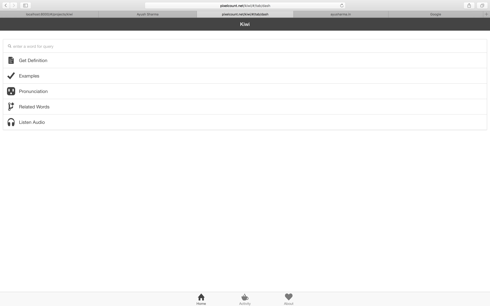
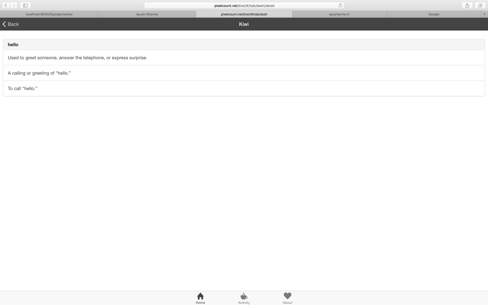
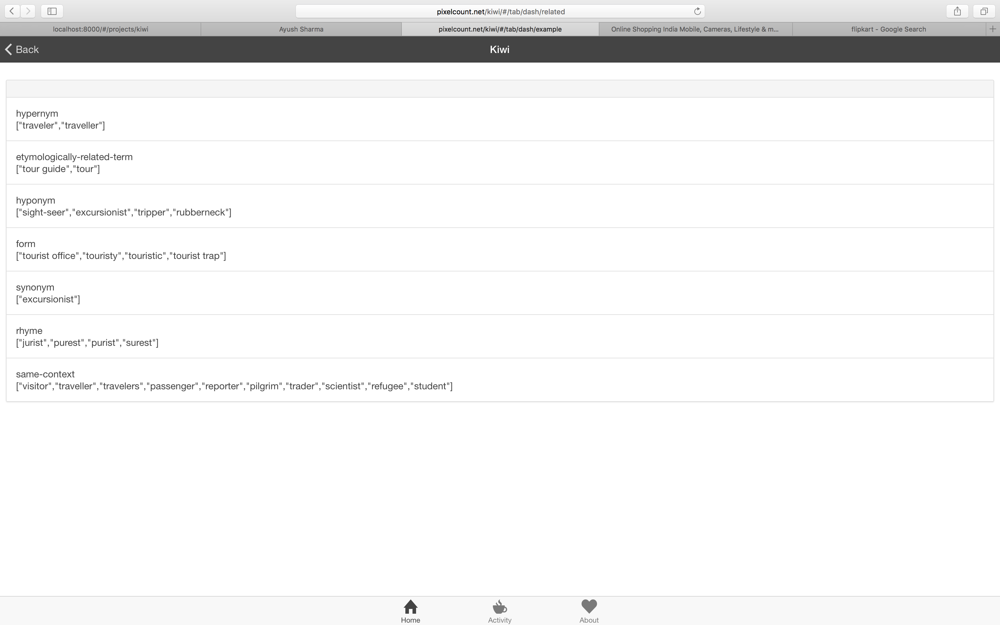
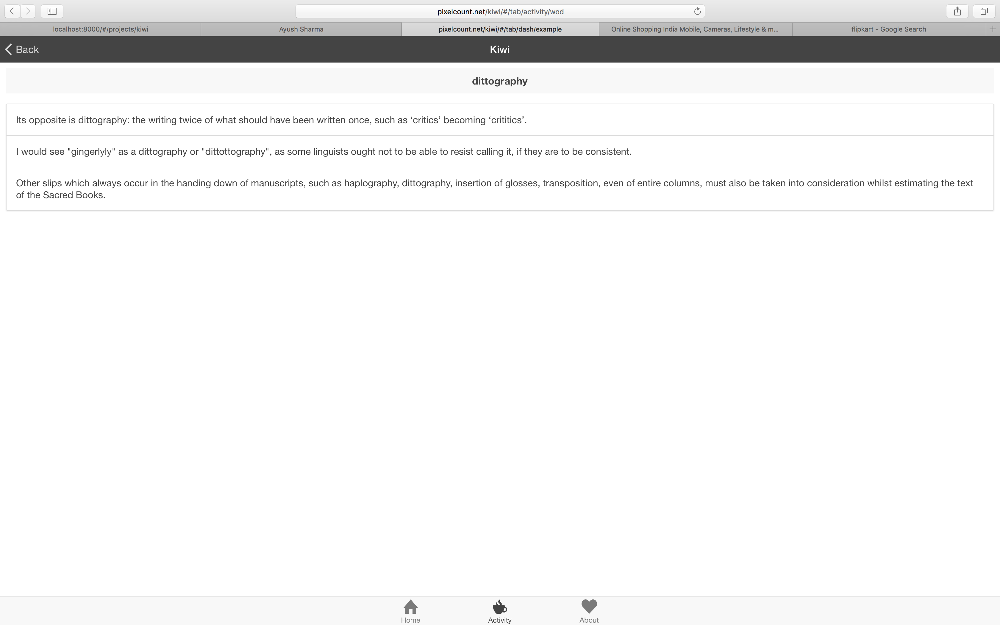
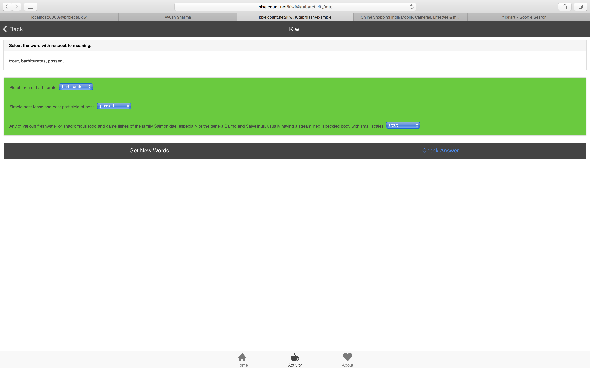
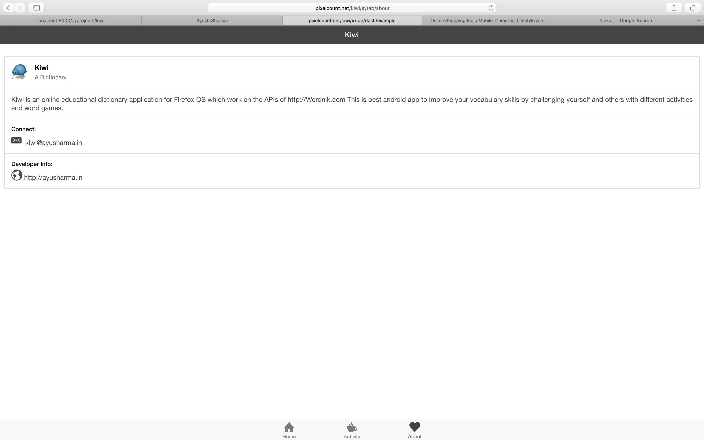

URL:
https://play.google.com/store/apps/details?id=com.ionicframework.kiwi474449

### Kiwi - A Dictionary
***
**Overview**: An online educational dictionary application for Android, Web and Firefox OS which work on the APIs of Wordnik. App helps to improve your vocabulary skills by challenging yourself and others with different activities and word games.

### Screenshots
***
This sections contains the final screen of the project which has been designed.

### Features
***
 - A Dictionary Application for Android, Web and Firefox OS
 - Get Definition, Examples, Related words, Pronunciation and Listen Audio for the input word
 - Activities like 'Word of the Day' & 'Match the Column' to improve vocabulary.

### Technology Stack
***
HTML5 CSS3 Angular JS Apache Cordova Ubuntu

### Learning & Experience
***
Kiwi was my first meet up with Android platform using the concept of Hybrid Applications.
 - Learned about Android architecture, Linux Kernel, Dalvik Virtual Machines and Java applications.
 - Concept of Hybrid applications using Apache Cordova Phonegap & Ionic
 - Learned about REST APIs, Access Methods (Tokens), APIs Quota and calls.
 - Used Ionic platform based on AngularJS to build application.
 - Setting up Android Environment in Linux and Live Debugging.
 - Setting up cross platform application at a single time.
 - Learned about Firefox OS marketplace, Manifesting and Hosting of Application.
 - Uploading application to Android playstore, Setting up production environment (Alpha, Beta, Statging).
 - Generating Secure Key store and Android App Releases and Updates.
